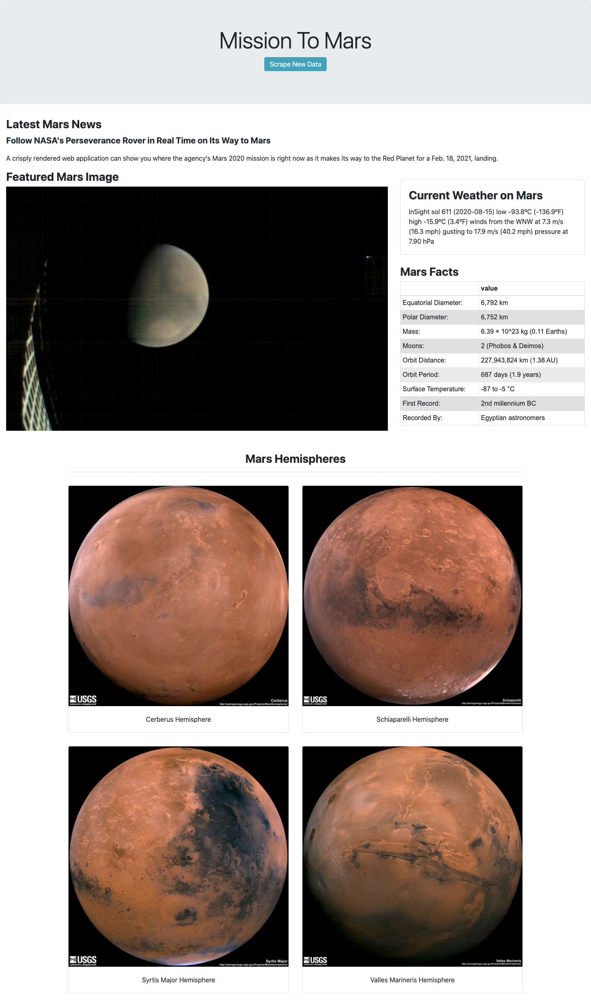

# Web Scraping Homework - Mission to Mars


This project is to build a web application that scrapes various websites for data related to the **Mission to Mars** and displays the information in a single HTML page. 


**Application is deployed as a Heroku app [https://missionmars.herokuapp.com/](https://missionmars.herokuapp.com/). Due to the limitation of the free version, performance is not as good as it is hosted locally. Also, some necessary changes are done for the sake of compatibility with chrome drivers in the Heroku dynos!**


## Step 1 - Scraping

Initial scraping using Jupyter Notebook, BeautifulSoup, Pandas, and Requests/Splinter.

- Codebase is [here](Analysis_Code/mission_to_mars.ipynb)
- All the urls used in the code are kept in [urls_list.py](Analysis_Code/urls_list.py)

**The following data is scraped and retrieved in the format mentioned below.**

### NASA Mars News

* Scraped the [NASA Mars News Site](https://mars.nasa.gov/news/) and collected the latest News Title and Paragraph Text. 

```python
# Example:
news_title = "NASA's Next Mars Mission to Investigate Interior of Red Planet"

news_p = "Preparation of NASA's next spacecraft to Mars, InSight, has ramped up this summer, on course for launch next May from Vandenberg Air Force Base in central California -- the first interplanetary launch in history from America's West Coast."
```

### JPL Mars Space Images - Featured Image

* JPL Featured Space Image is loacted [here](https://www.jpl.nasa.gov/spaceimages/?search=&category=Mars).

* Used splinter to navigate and find the image url for the current Featured Mars Image and retrieved full size image.

```python
# Example:
featured_image_url = 'https://www.jpl.nasa.gov/spaceimages/images/largesize/PIA16225_hires.jpg'
```

### Mars Weather

* Mars Weather information is retrieved from twitter account [here](https://twitter.com/marswxreport?lang=en) and scraped the latest Mars weather tweet from the page.

```python
# Example:
mars_weather = 'Sol 1801 (Aug 30, 2017), Sunny, high -21C/-5F, low -80C/-112F, pressure at 8.82 hPa, daylight 06:09-17:55'
```

### Mars Facts

* Mars Facts are located [here](https://space-facts.com/mars/).
* Used Pandas to retrieve the html table as dataframe and also to convert the data to a HTML table string.

### Mars Hemispheres

* Used USGS Astrogeology site [here](https://astrogeology.usgs.gov/search/results?q=hemisphere+enhanced&k1=target&v1=Mars) to obtain high resolution images for each of Mar's hemispheres and retrieved the full resolution images.

* Appended the dictionary with the image url string and the hemisphere titles to a list. This list contains one dictionary for each hemisphere.

```python
# Example:
hemisphere_image_urls = [
    {"title": "Valles Marineris Hemisphere", "img_url": "..."},
    {"title": "Cerberus Hemisphere", "img_url": "..."},
    {"title": "Schiaparelli Hemisphere", "img_url": "..."},
    {"title": "Syrtis Major Hemisphere", "img_url": "..."},
]
```

- - -

## Step 2 - MongoDB and Flask Application

- Scrape Codebase is [here](Code/scrape_mars.py)
- Flask app is [here](app.py)
- All the urls used in the code are kept in [urls_list.py](Code/urls_list.py)
- Please note that a config file needs to be created as `config.py` which contains `mongo_uri`. In my case, I have used [Free Mongo Cloud](https://www.mongodb.com/cloud), hence didn't keep the config file here to secure the password. **When you use a new DB, please ensure to click scrape button first**

<p>
    <div style="width:100;float:right">
        <p align="center">Final application looks as below!</p>
         
    </div>

Use MongoDB with Flask templating to create a new HTML page that displays all of the information that was scraped from the URLs above.

* A Consolidated code file is created  [`scrape_mars.py`](Code/scrape_mars.py) with a function called `scrape` that will execute all of the scraping code from above and return one Python dictionary containing all of the scraped data.

  - I have used some useful features in this script.
   - **`Multi threading`: To scrape simultaneously.**
   - **`Retry function`: As sometimes error occurs because of the webpages do not load fast. This function retries the scraping with extended wait times.**

* Next, create a flask app.

  - I have used `catch all` route to define the routes. This is to ensure there is a default route.

* Create a root route `/` that will query your Mongo database and pass the mars data into an HTML template to display the data.

* Create a template HTML file called [`index.html`](templates/index.html) that will take the mars data dictionary and display all of the data in the appropriate HTML elements. 
 - I have added a small `JS functionality` to scrape button (To disable it for 30 sec once it gets clicked. This is to avoid user clicking it continuously.)


* Create a default page [`default.html`](templates/default.html) (when user tries to access some random url, this page should pop up)
   
    <div style="width:100;float:right">
        <p align="center">Default page looks as below!</p>
         
    </div>  
   
 </p>   
 

 
 <p>
 
    <div style="width:80;float:left">
        <p align="center">Find me!</p>
         
    </div> 
    


**I have made this app responsive, using Bootstrap. The pictures above are when the app is in larger screens. In between two specific screen sizes, the app  would display the below quote. I will let you explore that yourself by playing around the screen sizes!!!**
   
 </p>
  
    
- - -
