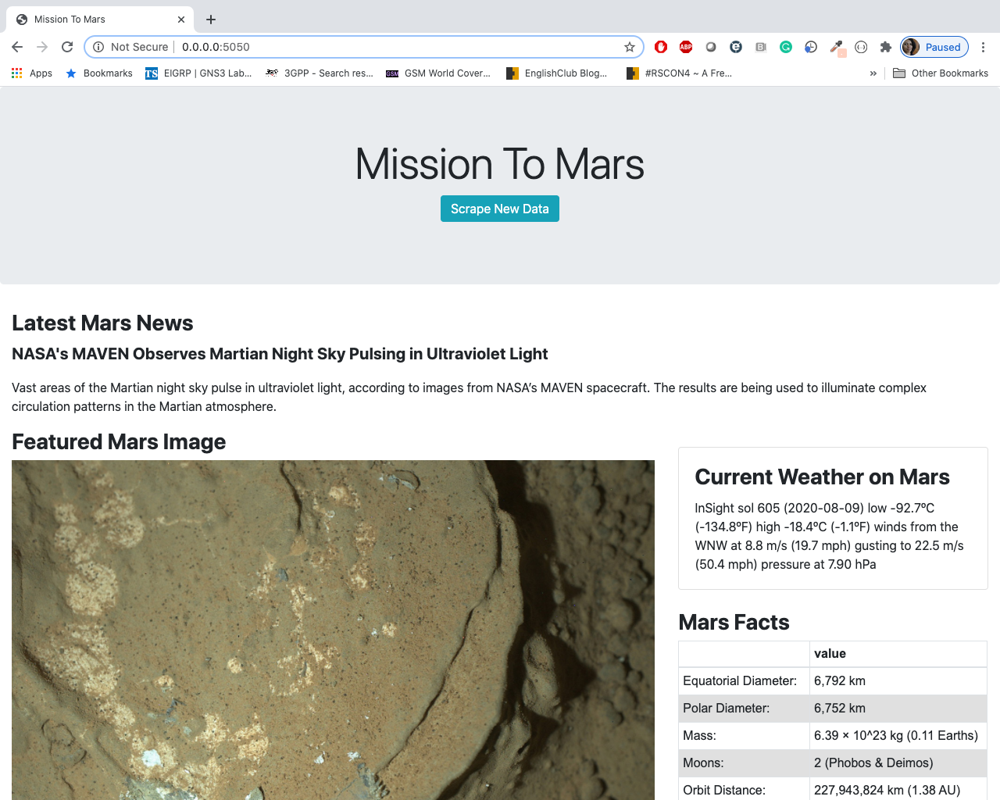

# Web Scraping Homework - Mission to Mars


This project is to build a web application that scrapes various websites for data related to the **Mission to Mars** and displays the information in a single HTML page. 


## Step 1 - Scraping

Initial scraping using Jupyter Notebook, BeautifulSoup, Pandas, and Requests/Splinter.

- Codebase is [here](Analysis_Code/mission_to_mars.ipynb)
- All the urls used in the code are kept in [urls_list.py](Analysis_Code/urls_list.py)

**The following data is scraped and retrieved in the format mentioned below**

### NASA Mars News

* Scraped the [NASA Mars News Site](https://mars.nasa.gov/news/) and collected the latest News Title and Paragraph Text. 

```python
# Example:
news_title = "NASA's Next Mars Mission to Investigate Interior of Red Planet"

news_p = "Preparation of NASA's next spacecraft to Mars, InSight, has ramped up this summer, on course for launch next May from Vandenberg Air Force Base in central California -- the first interplanetary launch in history from America's West Coast."
```

### JPL Mars Space Images - Featured Image

* JPL Featured Space Image is loacted [here](https://www.jpl.nasa.gov/spaceimages/?search=&category=Mars).

* Used splinter to navigate and find the image url for the current Featured Mars Image and retrieved full size image.

```python
# Example:
featured_image_url = 'https://www.jpl.nasa.gov/spaceimages/images/largesize/PIA16225_hires.jpg'
```

### Mars Weather

* Mars Weather information is retrieved from twitter account [here](https://twitter.com/marswxreport?lang=en) and scrape the latest Mars weather tweet from the page.

```python
# Example:
mars_weather = 'Sol 1801 (Aug 30, 2017), Sunny, high -21C/-5F, low -80C/-112F, pressure at 8.82 hPa, daylight 06:09-17:55'
```

### Mars Facts

* Mars Facts are located [here](https://space-facts.com/mars/).
* Used Pandas to retrieve the html table as dataframe and to convert the data to a HTML table string.

### Mars Hemispheres

* Used USGS Astrogeology site [here](https://astrogeology.usgs.gov/search/results?q=hemisphere+enhanced&k1=target&v1=Mars) to obtain high resolution images for each of Mar's hemispheres and retrieved the full resolution images.

* Appended the dictionary with the image url string and the hemisphere titles to a list. This list contains one dictionary for each hemisphere.

```python
# Example:
hemisphere_image_urls = [
    {"title": "Valles Marineris Hemisphere", "img_url": "..."},
    {"title": "Cerberus Hemisphere", "img_url": "..."},
    {"title": "Schiaparelli Hemisphere", "img_url": "..."},
    {"title": "Syrtis Major Hemisphere", "img_url": "..."},
]
```

- - -

## Step 2 - MongoDB and Flask Application

Codebase is [here](Analysis_Code/mission_to_mars_selenium_version.ipynb)
All the urls used in the code are kept in [urls_list.py](Analysis_Code/urls_list.py)


Used MongoDB with Flask templating to create a new HTML page that displays all of the information that was scraped from the URLs above.

* Start by converting your Jupyter notebook into a Python script called `scrape_mars.py` with a function called `scrape` that will execute all of your scraping code from above and return one Python dictionary containing all of the scraped data.

* Next, create a route called `/scrape` that will import your `scrape_mars.py` script and call your `scrape` function.

  * Store the return value in Mongo as a Python dictionary.

* Create a root route `/` that will query your Mongo database and pass the mars data into an HTML template to display the data.

* Create a template HTML file called `index.html` that will take the mars data dictionary and display all of the data in the appropriate HTML elements. Use the following as a guide for what the final product should look like, but feel free to create your own design.




- - -

## Step 3 - Submission

To submit your work to BootCampSpot, create a new GitHub repository and upload the following:

1. The Jupyter Notebook containing the scraping code used.

2. Screenshots of your final application.

3. Submit the link to your new repository to BootCampSpot.

## Hints

* Use Splinter to navigate the sites when needed and BeautifulSoup to help find and parse out the necessary data.

* Use Pymongo for CRUD applications for your database. For this homework, you can simply overwrite the existing document each time the `/scrape` url is visited and new data is obtained.

* Use Bootstrap to structure your HTML template.

### Copyright

Trilogy Education Services © 2019. All Rights Reserved.
